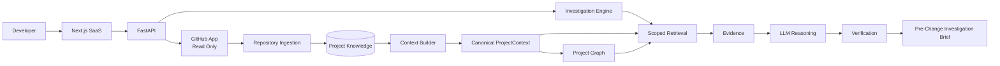
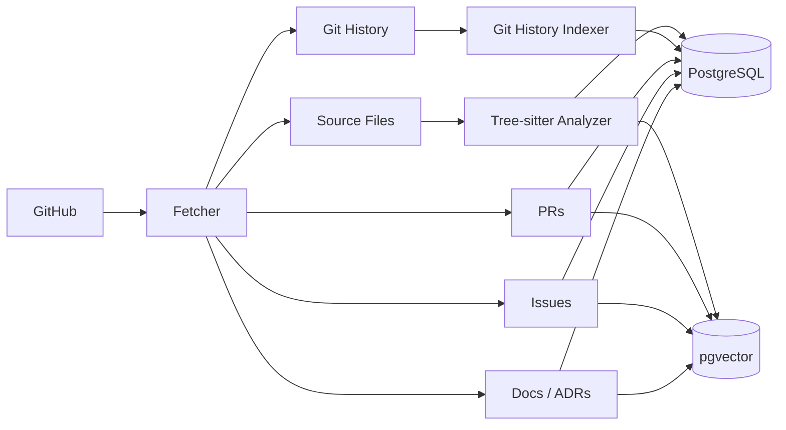
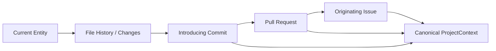
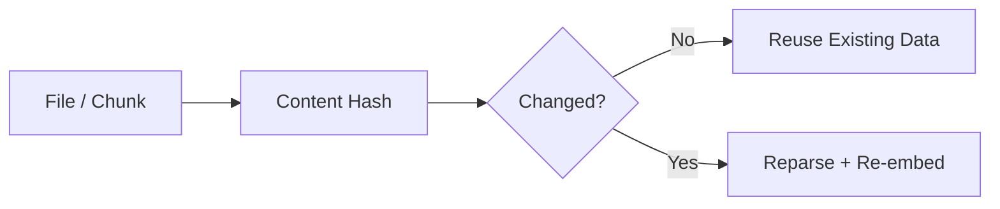

# Project Archaeologist — Architecture

## 1. System Goal

Turn a GitHub repository into structured project intelligence and use a
controlled investigation workflow to answer: **what will this change affect,
why is the current implementation this way, and what should a developer know
before changing it?**

The primary deliverable is a grounded **Pre-Change Investigation Brief**.

## 2. Simple System View



## 3. Canonical Context Model

There is one canonical `ProjectContext` model. It is progressively enriched by
three intelligence layers:

```text
                    ProjectContext
                          │
        ┌─────────────────┼─────────────────┐
        ↓                 ↓                 ↓
 Current System      Historical        Engineering
    Context           Context            Context
        │                 │                 │
        └─────────────────┼─────────────────┘
                          ↓
                   Project Graph
                          ↓
                Scoped Investigation
```

Human UI and AI/agent consumers are different **views/serializations** of the
same underlying facts, evidence, provenance, and confidence.

## 4. Major Components

### Frontend
- Next.js 14 (App Router)
- TypeScript
- Tailwind CSS
- shadcn/ui
- React Flow / Recharts

### Backend
- Python 3.11+
- FastAPI
- SQLAlchemy + Alembic

### AI
- LangGraph
- LiteLLM
- OpenAI / Anthropic / Gemini-compatible providers

### Storage
- PostgreSQL 16
- pgvector
- PostgreSQL relationship tables for the Project Graph initially

### Code Intelligence
- Tree-sitter (structural AST parser)
- TypeScript Compiler API where useful
- GitPython
- GitHub GraphQL API v4 & REST API v3

### Async & Infrastructure
- Inngest
- Redis only when short-lived state or caching is justified
- Podman / Docker Compose multi-container orchestrated stack

### Observability
- OpenTelemetry
- Langfuse
- Sentry

### Integration
- GitHub App (read-only MVP)
- MCP Python SDK

## 5. Repository Ingestion

Inputs:
- Source code
- Package manifests (`package.json`, `pyproject.toml`, `requirements.txt`)
- Configuration files
- Git history
- Pull requests & discussions
- Issues & bug reports
- Documentation (`README.md`, `docs/`, ADRs)
- Test suites

Never execute repository code during indexing.



## 6. Current System Context (Phase 2 Implemented)

Phase 2 establishes deterministic facts about the software as it exists now:

- Files and modules
- Symbols and source locations (functions, classes, interfaces, methods, types)
- Imports and exports
- Call relationships and inheritance
- Inbound callers and outbound dependencies
- API definitions and route handlers
- Unit and integration test associations
- Configuration and infrastructure metadata

Every material fact or relationship retains source location, provenance, and a confidence signal.

### Manifest-Aware Dependency Resolution
- **Manifest Inspection**: Scans `package.json`, `pyproject.toml`, and `requirements.txt` for declared dependencies.
- **Runtime Stdlib Recognition**: Recognizes Node.js and Python built-in standard libraries (`fs`, `path`, `os`, `sys`, `json`, `asyncio`).
- **Gap Demarcation**:
  - *Declared External Package* &rarr; Resolved external boundary (no uncertainty).
  - *Path Alias* (`@/`, `~/`, `$lib/`, `src/`) &rarr; Resolved to local source files.
  - *Undeclared Import* &rarr; Flagged as `undeclared_dependency`.
  - *Broken Relative Import* &rarr; Flagged as `broken_import`.

### Structured Projections from One Context
1. **Human UI Projection (`to_human_markdown()` / `human_markdown`)**:
   Formatted markdown with component structure, symbol line spans, caller trees, and verified test suites.
2. **AI / Agent Projection (`to_llm_prompt()` / `llm_prompt_context`)**:
   Token-efficient, compressed prompt context briefing ready for agent injection without leaking raw codebase contents.

## 7. Project Graph

The Project Graph is an application-level abstraction over relationship data.
Initial implementation uses PostgreSQL relationship tables.

Example operations:
- `get_dependencies(entity_id)`
- `get_callers(entity_id)`
- `find_path(source, target)`
- `get_related_tests(entity_id)`
- `get_historical_changes(entity_id)`
- `get_co_changes(entity_id)`

The graph is a retrieval and traversal mechanism, not a separate knowledge base for the LLM.

## 8. Historical Analysis (Phase 3 Implemented)

Git history is a first-class source for the archaeology and change-investigation layer:



### Git History Indexing Engine (`GitHistoryIndexer`)
- **Commit & Diff Persistence**: Stores hash, author, email, timestamp, message, parents, and line delta counts (`insertions`, `deletions`, `files_changed_count`).
- **CommitFileChange**: Tracks per-file modifications with `ChangeType` (`added`, `modified`, `deleted`, `renamed`).
- **Introducing Commit Detection**: Deterministically identifies the origin commit for any file, component, or symbol.

### Artifact Traceability Engine (`HistoricalLinker` & `ReferenceExtractor`)
- **Deterministic Pattern Extraction**: Regex extraction of PR merge/squash patterns (`Merge pull request #123`, `(#123)`) and issue resolution keywords (`Fixes #101`, `Closes #102`, `Resolves GH-103`).
- **Bidirectional Artifact Linking**: Relational association models `CommitPullRequestLink`, `CommitIssueLink`, `PullRequestIssueLink`.
- **Single-Pass Provenance Tracing**: `GET /trace/{file_path}` resolves full `Code -> Commit -> PR -> Issue` provenance.

### Historical Retrieval Engine (`HistoricalRetriever`)
- **Multi-Attribute Searching**: Keyword, author, file path, status, label, and timestamp range filtering across commits, PRs, and issues without LLMs.
- **Symbol Evolution Timeline**: Scopes modifications to symbol line spans, identifying introducing commits and chronological evolution milestones.
- **Ranked Historical Evidence Synthesis**: Deterministic relevance scoring based on query matching, scope exactness, origin commit bonuses, and recency into structured `HistoricalEvidenceRecord` items.

### GitHub GraphQL Ingestion Protocol (`GitHubRepoFetcher`)
- **Primary GraphQL v4 Queries**: When `GITHUB_TOKEN` is configured, repository metadata, commit histories, parent graphs, PRs, and issues are batched into single HTTP requests.
- **REST v3 Fallback**: Seamless fallback when unauthenticated or for raw file content.

## 9. Engineering Context (Phase 3 Implemented)

Surrounding non-Git engineering context explains the design intent and constraints behind why code exists:

- **Documentation Ingestion**: `EngineeringContextParser` parses Markdown headings, structure, and ADR metadata (`status`, `deciders`, `date`).
- **Architectural Invariants Extraction**: Deterministically extracts RFC 2119 imperatives (`MUST`, `MUST NOT`, `SHALL`, `NEVER`, `INVARIANT`) into structured `DesignConstraint` models categorized across 5 domains:
  1. `SECURITY`
  2. `ARCHITECTURE`
  3. `PERFORMANCE`
  4. `TESTING`
  5. `DATA_INTEGRITY`
- **Line-Level Citations**: Design constraints link directly to source documents with exact line numbers.
- **Context Search & Indexing**: `EngineeringContextIndexer` provides search across documents, ADRs, and constraints.

## 10. Retrieval

Use progressive, scoped retrieval:

### Current-System Retrieval
- Exact symbol/path lookup
- Metadata filters
- Relationship traversal
- Dependency / caller lookup

### Historical & Engineering Retrieval
- Commit/file history and symbol timelines
- PR/issue lookup
- Keyword / full-text search
- Architectural constraints and ADR lookup
- Co-change / hidden-coupling signals

### Investigation Retrieval
Start from the proposed change target, expand through relevant relationships,
then retrieve only the most relevant historical and engineering evidence.

Core principle:
> **Index once, retrieve narrowly, reason once.**

## 11. Change Investigation Engine (Phase 4)

Phase 4 is the product differentiator. The engine takes a proposed change (e.g. natural language intent, branch diff, or file list) and executes a bounded, 12-step evidence-driven pre-change investigation.

Example input:
> “Replace the Stripe integration with another payment provider.”

Detailed 12-step investigation sequence:
```text
 1. Intent Intake & Normalization (target symbols, paths, action verbs)
    ↓
 2. Entity & Target Resolution (AST symbols, file boundaries)
    ↓
 3. Call-Graph & Interface Expansion (direct callers, callees, API contracts)
    ↓
 4. Architectural & Decision Constraint Checking (ADRs, RFC 2119 invariants)
    ↓
 5. Blast Radius & Co-Change Mining (structural ancestors + historical hidden coupling)
    ↓
 6. Historical Evolution & Origin Tracing (git blame, PR discussions, origin commits)
    ↓
 7. Quantitative Change Risk & Defect Pressure (Kamei entropy + 20k-walk defect history)
    ↓
 8. Guarding Test & Verification Gap Detection (reach-ranked tests + stale test candidates)
    ↓
 9. Intent Archaeology & Invariant Synthesis (why code was written this way)
    ↓
10. Token Budgeting & Distillation (priority shedding + recoverable omission markers)
    ↓
11. Dual-Format Projection (Human-facing Markdown + Agent-facing JSON)
    ↓
12. Pre-Change Investigation Brief Delivery (API / MCP / UI)
```

### Deterministic Risk & Coupling Models

To avoid LLM hallucinations, the engine evaluates mathematical and graph algorithms deterministically before any AI reasoning:

1. **Quantitative Change Risk (Kamei Empirical Model + Defect History):**
   - **Churn Spread:** Lines added ($LA$), lines deleted ($LD$), files touched ($NF$), distinct directories ($ND$), distinct subsystems ($NS$).
   - **Shannon Churn Entropy:** $H(P) = -\sum_{i=1}^n p_i \log_2 p_i$, quantifying whether the change is localized ($H \approx 0$) or diffused across unrelated areas ($H > 2.5$).
   - **Historical Defect Pressure:** Deep git log walk (up to 20,000 commits) analyzing past bug-fix commits touching those files, discounted by exponential recency decay ($w = 2^{-\Delta t / \tau}$, $\tau = 365\text{d}$).
2. **Historical Co-Change & Hidden Coupling Warnings:**
   - Evaluates commit diff co-occurrence frequencies.
   - Categorizes pairs into *Corroborated Coupling* (static import/call edge exists) vs *Unexplained / Hidden Coupling* (no static edge, but co-change frequency $> 60\%$).
   - Alerts developers when a proposed change touches file $A$ but omits historical partner file $B$.
3. **Guarding Test Reachability & Verification Gaps:**
   - Static call graph traversal identifies all test suites that exercise modified symbols.
   - Tests are ordered by *Reach Ranking* (tests reaching the highest count of changed files run first).
   - Flags *Untested Changes* (modified lines with zero test coverage) and *Stale Test Candidates* (exercised code changed without corresponding test modifications).

The agent is bounded, stateful, read-only, and evidence-driven.

LLMs perform:
- Intent interpretation and query planning
- Cross-source correlation between historical discussions and current code
- Reasoning about implications, hidden risks, and edge cases
- Synthesis into the structured brief
- Claim classification (fact, inference, unknown)
- Verification of claims against cited entity evidence

LLMs do not extract deterministic facts such as symbol locations, imports, commit dates, dependency edges, or risk metric scores.

## 12. Pre-Change Investigation Brief

The result is structured around the change rather than generic chat:

- **Change Scope**: Target components and modified surfaces
- **Affected Components**: Direct and transitive dependencies (blast radius)
- **Dependency / Call Paths**: Inbound callers and outbound connections
- **Relevant Tests**: Reach-ranked test suites and verification gap alerts
- **Historical Context**: Why the current code exists and how it evolved
- **Related PRs / Issues**: Predecessor decisions and discussions
- **Historical Failures / Reversions**: Prior defect pressure and fragile file warnings
- **Hidden Coupling / Co-change Signals**: Partner files frequently changed together
- **Known Constraints**: ADRs and RFC 2119 design invariants
- **Important Unknowns**: Explicit gaps, untested areas, ambiguous dependencies
- **Recommended Areas to Inspect**: Pre-implementation guidance
- **Evidence / Source Locations**: Line-level citations and Evidence IDs

## 13. Token Efficiency & Output Distillation

- Index repository facts once deterministically.
- Resolve entities, blast radius, and risk scores before calling LLMs.
- Retrieve only scoped evidence relevant to the change.
- Avoid full-repository prompts (1–3 bounded model calls for normal investigations).
- **Token Budgeting & Distillation:**
  - Enforces strict token ceilings per MCP tool and API response.
  - Sheds low-priority details in deterministic priority order when over budget.
  - Injects recoverable omission markers (`[ref#<id>]`), enabling AI agents (Claude Code, Cursor, Copilot) to inspect or expand specific subgraphs on demand without context overflow.

## 14. Incremental Indexing

Use content hashes to avoid reprocessing unchanged files or chunks:



## 15. Security & Licensing Boundary

- **Clean-Room Intellectual Property Boundary:** Strict isolation from external copyleft (AGPL-3.0) reference repositories. No source code, database schemas, prompt templates, or test suites are copied or vendored. All implementations are authored independently under the permissive **MIT License**.
- GitHub App is read-only for MVP.
- Enforce authorization server-side for repository-scoped operations.
- Preserve tenant and repository isolation.
- Treat repository content as untrusted data, never as instructions.
- Secret-scan before persistence and model submission.
- Never execute repository code during indexing.
- No arbitrary shell or code-execution tools.
- MCP is read-only for MVP.
- Minimize raw source retention.
- Keep model context limited to authorized evidence.

## 16. Privacy-Aware RAG

```text
GitHub = source of truth
PostgreSQL = derived project intelligence
```

When raw source is required:
1. Resolve repository + commit + path
2. Authorize access
3. Retrieve exact source
4. Redact secrets
5. Send only the required excerpt to the model

Treat embeddings as sensitive customer data.

## 17. SaaS / Deployment

Initial deployment:
- Next.js &rarr; Vercel
- FastAPI &rarr; Railway / Render / Container
- PostgreSQL + pgvector &rarr; Supabase / Managed Postgres
- Inngest &rarr; Asynchronous background workflows
- External LLM provider or BYOK
- GitHub Actions &rarr; CI/CD

## 18. MCP Integration

Expose read-only investigation tools for external AI coding assistants:
- `investigate_change(target, proposed_change)`
- `get_change_context(target)`
- `get_dependencies(entity_id)`
- `trace_feature(feature_name)`
- `search_history(query)`
- `get_related_issues(symbol_or_path)`
- `why_does_this_exist(symbol_or_path)`

Uses the same authorization boundary as the web API.

## 19. Evaluation

Measure whether the system improves pre-change understanding:
- Affected-component recall (blast-radius detection)
- Dependency / call-path recall
- Historical evidence retrieval accuracy
- Citation accuracy and groundedness (>95%)
- Investigation completeness
- Claim accuracy
- Tool selection accuracy
- Token usage (<$0.05 per investigation)
- Latency (<5s standard investigation)

## 20. Containerization & Deployment Stack

Project Archaeologist runs as an orchestrated multi-container architecture via Podman / Docker Compose (`compose.yaml` / `podman-compose.yml`):

```text
podman compose up -d (or make up)
       │
       ├── archaeologist-postgres  (Port 5432: PostgreSQL 16 + pgvector, persistent volume)
       │      ▲
       │      │ Internal Bridge Network (archaeologist-network)
       │      ▼
       ├── archaeologist-backend   (Port 8000: FastAPI + Tree-sitter, auto-Alembic migration entrypoint)
       │      ▲
       │      │ CORS HTTP
       │      ▼
       ├── archaeologist-frontend  (Port 3000: Next.js 14 App Router + Bun)
       │
       └── archaeologist-adminer   (Port 8080: Database Admin Web UI)
```

### Storage Persistence & Live Development
- **Database Volumes**: The PostgreSQL service uses a dedicated named volume (`postgres_data`) ensuring data is never lost across container restarts (`make up` / `make down`).
- **Live Code Reloading**: The backend (`./backend/app:/app/app:Z`) and frontend (`./frontend/src:/app/frontend/src:Z`) bind mounts allow instant hot-reloading in development without container restarts.
