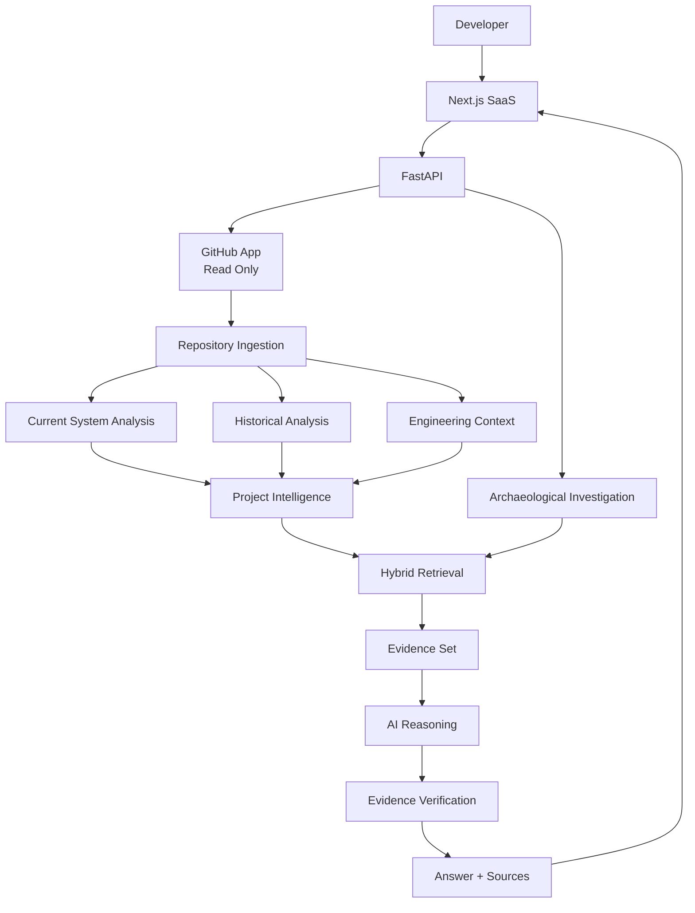
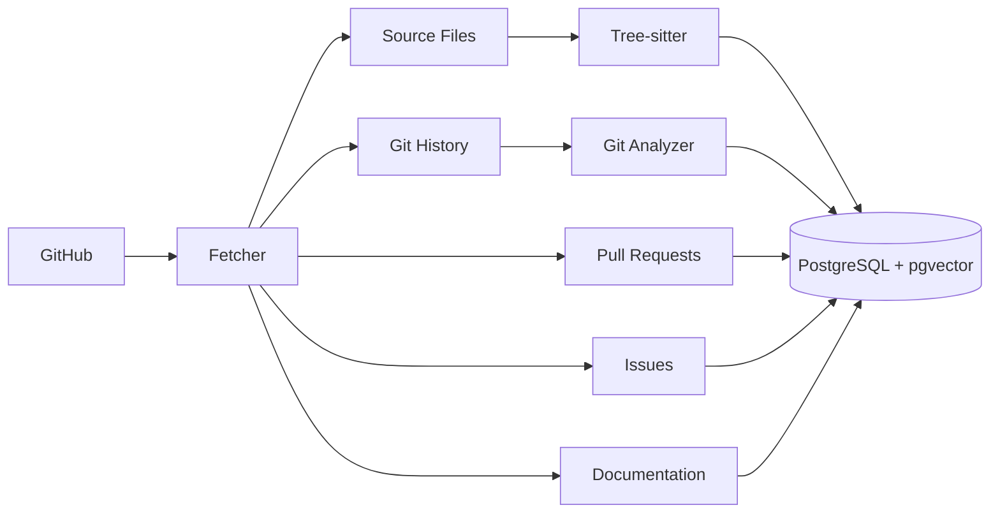
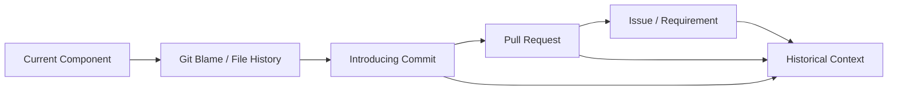
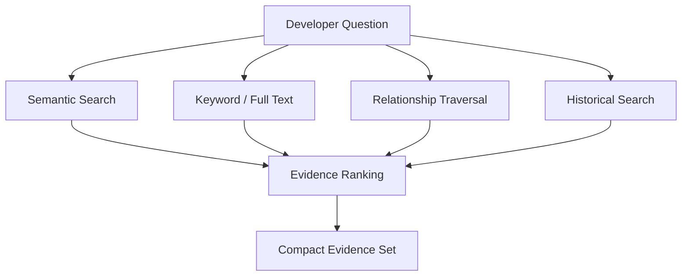
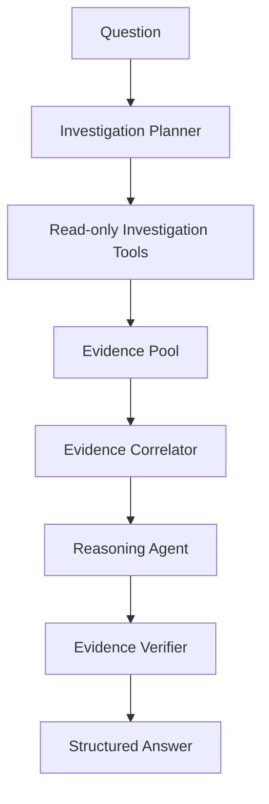
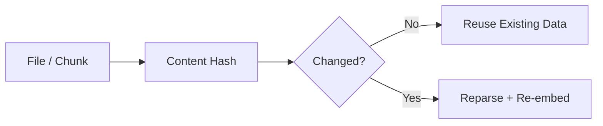

# Project Archaeologist — Architecture

## 1. Architecture Goal

Project Archaeologist turns a repository into **Project Intelligence** that
combines:

1. Current System — what exists today
2. Historical Context — how it evolved
3. Engineering Context — documentation, decisions, tests, issues, and constraints

The agentic layer investigates this intelligence to answer developer questions
with evidence.

## 2. Core Architecture



## 3. Three Intelligence Layers

### Current System

Deterministic representation of what exists now:

- files
- symbols
- classes/functions
- APIs
- dependencies
- tests
- configuration
- architecture relationships

### Historical Context

Representation of how the software changed:

- commits
- file history
- blame
- pull requests
- issues
- migrations
- major changes

### Engineering Context

Supporting information that explains the system:

- documentation
- architecture decisions
- tests
- known issues
- feature requirements where available
- constraints and surrounding engineering artifacts

The three layers are intentionally combined before AI reasoning.

---

## 4. Repository Ingestion

Ingestion is primarily deterministic and asynchronous.



Never execute repository code during indexing.

---

## 5. Current System Analysis

Tree-sitter and deterministic analysis extract:

- files
- symbols
- imports/exports
- functions/classes
- APIs
- dependencies
- test relationships where detectable

Initial language support:
- TypeScript/JavaScript

Python can be added after the first working vertical slice.

Example:

```text
PaymentService
├── imports StripeClient
├── imports Redis
├── calls OrderRepository
├── called by CheckoutService
└── tested by PaymentService.test.ts
```

---

## 6. Historical Analysis

Git history is a major input to Project Intelligence.



The system should reconstruct change paths, not simply display raw Git history.

Example:

```text
PaymentService
  ↓
Webhook retry introduced
  ↓
PR #481
  ↓
PAY-912
  ↓
Webhook delivery failures
```

This becomes the historical evidence behind an AI explanation.

---

## 7. Project Intelligence Storage

Use PostgreSQL as the primary store and pgvector for semantic retrieval.

Persist:
- repositories
- files
- symbols
- commits
- pull requests
- issues
- docs
- evidence
- investigations
- agent runs
- metadata
- embeddings
- relationship tables

Represent graph relationships in PostgreSQL initially.

Do not introduce a separate graph database until real workload requires it.

---

## 8. Hybrid RAG

Project Archaeologist does not rely on vector search alone.



Use:

- semantic retrieval for conceptual similarity,
- keyword retrieval for exact symbols/names,
- graph traversal for relationships,
- historical retrieval for temporal questions,
- metadata filters for repository/commit scope.

---

## 9. Investigation Engine

The investigation engine is the product's AI layer.

It should use a bounded LangGraph workflow, not a large autonomous swarm.



### Tool examples

- search_code()
- get_file()
- get_symbol()
- get_dependencies()
- get_callers()
- search_history()
- get_commit()
- search_pull_requests()
- search_issues()
- search_docs()
- get_related_tests()
- trace_feature()
- get_architecture()

---

## 10. Investigation Types

### Understand

> How does checkout work?

Uses current system relationships and relevant context.

### Why

> Why does this workaround exist?

Uses current code + historical evidence + surrounding engineering context.

### History

> How did authentication evolve?

Reconstructs historical changes and their relationships.

### Before Change

> What should I know before modifying PaymentService?

Combines current dependencies, historical changes, known issues, tests, and
important decisions.

The same engine supports all four.

---

## 11. Evidence and Reasoning

Evidence is gathered before the model reasons.

Example:

```text
Code:
retryCount > 3

Commit:
Added webhook retry

PR:
Handle failed webhook delivery

Issue:
PAY-912

Test:
WebhookRetry.spec.ts
```

The reasoning layer synthesizes the relationship.

The answer must distinguish:

### Fact
Directly supported evidence.

### Inference
Conclusion derived from multiple sources.

### Unknown
Evidence is insufficient.

Every important claim should reference Evidence IDs.

---

## 12. LLM Usage

Use LLMs for:
- question interpretation
- investigation planning
- evidence correlation
- reasoning
- answer synthesis
- optional verification

Do not use LLMs for:
- parsing code
- finding imports
- reading Git metadata
- basic dependency queries
- exact symbol lookup

Target normal investigation cost:
- optional planner call
- one reasoning call
- optional lightweight verification

Never send the whole repository to a model.

---

## 13. Token Efficiency

Core principle:

> **Index once, retrieve narrowly, reason once.**

Techniques:
- deterministic preprocessing
- content hashes
- incremental indexing
- cached embeddings
- metadata filtering
- hybrid retrieval
- compact structured tool results
- minimal evidence sets

AI usage should be measured per investigation.

---

## 14. Privacy-Aware RAG

Preferred model:

```text
GitHub = source of truth
PostgreSQL = derived project intelligence
```

Persist mainly:
- embeddings
- hashes
- metadata
- Git metadata
- relationships

When exact code is needed:
1. resolve repository + commit + path,
2. authorize access,
3. retrieve source,
4. redact secrets,
5. provide only the necessary excerpt to the model.

Embeddings remain confidential customer data.

---

## 15. Incremental Indexing

Use content hashes.



The repository should not be reprocessed when only a small subset changed.

---

## 16. Security

- GitHub App read-only for MVP.
- Server-side authorization for every repository-scoped request.
- Tenant and repository isolation.
- Secret scanning.
- No repository code execution.
- Repository content treated as untrusted data.
- No arbitrary shell/code execution tools.
- Read-only MCP.
- Minimal LLM context.
- Minimize raw source retention.

---

## 17. SaaS

Initial deployment:

- Vercel → Next.js
- Railway/Render → FastAPI + workers
- Supabase → PostgreSQL + pgvector
- Inngest → background jobs
- external LLM provider or BYOK
- GitHub Actions → CI

Avoid unnecessary infrastructure.

---

## 18. MCP

Expose the same Project Intelligence through read-only MCP tools.

Examples:
- why_does_this_exist()
- trace_feature()
- search_history()
- get_architecture()
- get_change_context()
- get_related_issues()

The MCP layer must enforce the same authorization and data boundaries as the web
API.

---

## 19. Evaluation

Evaluate all four investigation types:

- current-system understanding,
- why reasoning,
- historical reconstruction,
- pre-change context.

Metrics:
- retrieval recall
- citation accuracy
- groundedness
- historical accuracy
- tool selection accuracy
- agent success rate
- token usage
- latency
