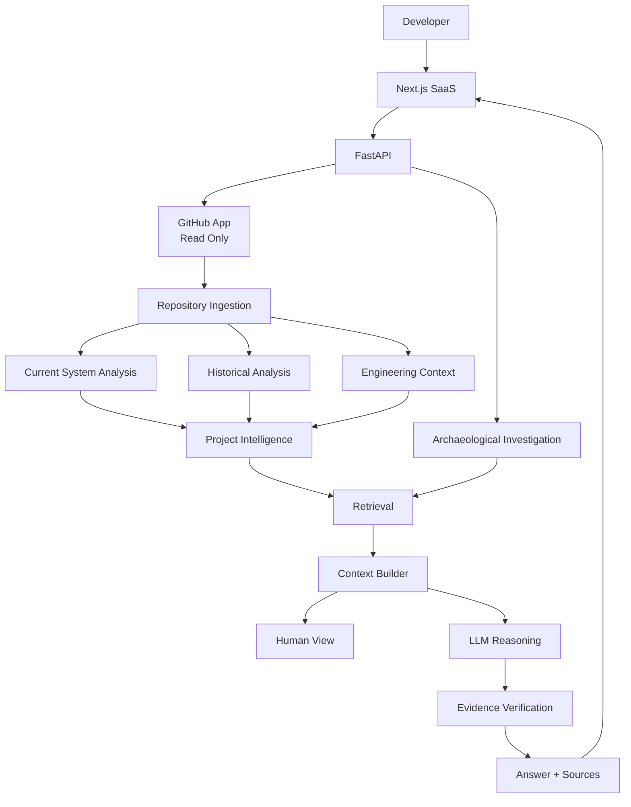
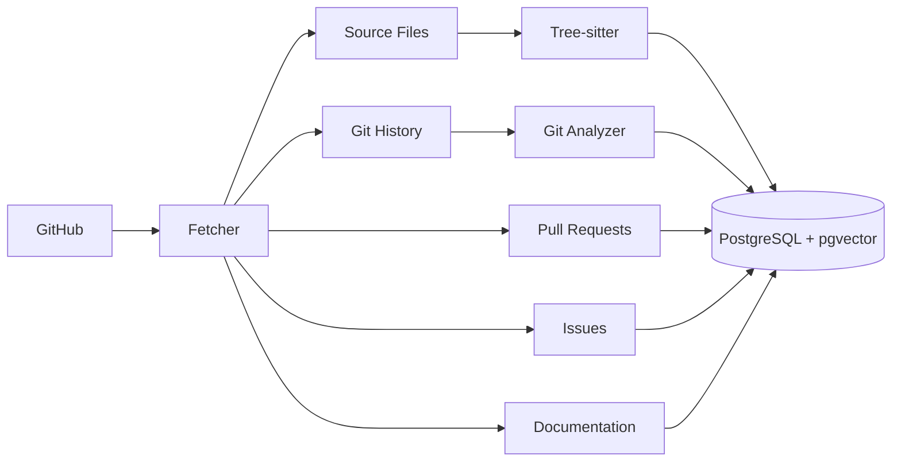
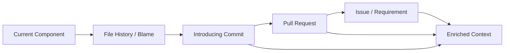
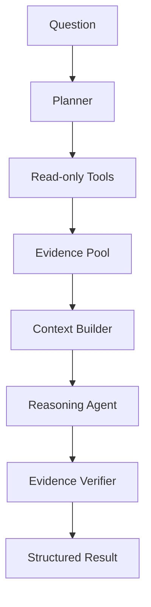

# Project Archaeologist — Architecture

## 1. Architecture Goal

Turn a repository into **Project Intelligence** with three layers:

1. **Current System** — what exists today
2. **Historical Context** — how it evolved
3. **Engineering Context** — docs, decisions, tests, issues, constraints

The agentic layer investigates this intelligence to answer developer questions with evidence.

## 2. Core Architecture



## 3. Major Components

### Frontend
- Next.js
- TypeScript
- Tailwind CSS
- shadcn/ui
- React Flow

### Backend
- Python
- FastAPI

### AI
- LangGraph
- LiteLLM
- OpenAI / Anthropic / Gemini-compatible providers

### Storage
- PostgreSQL
- pgvector
- PostgreSQL relationship tables initially

### Code Intelligence
- Tree-sitter
- TypeScript Compiler API where useful
- GitPython
- GitHub REST/GraphQL APIs

### Async
- Inngest
- Redis only when needed for caching/short-lived state

### Observability
- OpenTelemetry
- Langfuse
- Sentry

### Integration
- GitHub App
- MCP Python SDK

## 4. Current System Context Layer

Phase 2 builds a **reliable current-system context layer**.

The goal is not to perfectly understand every runtime behavior or every programming language.

The goal is to produce enough trustworthy structure that:
- a human can understand an unfamiliar component,
- retrieval can find the right code and relationships,
- the LLM can receive a compact, useful briefing.

### Structural Analysis

Use deterministic tooling for:
- files
- symbols
- imports/exports
- functions/classes
- basic references
- basic calls
- APIs
- test locations

Tree-sitter is the primary structural parser.

### Semantic Analysis

Use language-aware tooling where useful for:
- symbol resolution
- types
- call targets
- import resolution

For the initial TypeScript/JavaScript implementation, use the TypeScript Compiler API where it materially improves resolution.

Do not attempt perfect dynamic-runtime analysis.

### Metadata Analysis

Collect:
- package/framework metadata
- configuration
- test framework
- database/service indicators
- repository structure

### Relationship Confidence

Relationships should carry provenance and confidence when applicable.

```text
PaymentService
    ↓ calls
StripePayment.refund()

confidence: 0.98
resolution_method: typescript_type_checker
```

Heuristic relationships should be labeled accordingly.

### Current-System Model

The normalized model should support:

```text
Repository
├── Applications
├── Services / Modules
├── Components
├── APIs
├── Symbols
├── Dependencies
├── Tests
└── External Dependencies
```

### Canonical Unified ProjectContext

Phase 2 introduces the canonical `ProjectContext` model.

It serves as the single authoritative context layer shared by both the human UI and AI/Agent prompt pipelines without maintaining separate knowledge extraction pipelines.

```text
Project Knowledge
      ↓
Context Builder
      ↓
Project Context
   ├── Human UI (Markdown / Visual graph)
   └── AI / Agent (Token-efficient prompt serialization)
```

The canonical `ProjectContext` model preserves:
- **Entities**: Files, AST symbols (classes, functions, interfaces, methods, types)
- **Relationships**: Outbound dependencies, inbound callers, inheritance, test links
- **Evidence**: Concrete AST nodes and import lines with provenance
- **Confidence**: Deterministic extraction confidence scores (e.g. `1.0` for AST, `0.90` for filename heuristics)
- **Unknowns & Gaps**: Untested components, unresolved external packages, empty files, low-confidence relationships

#### Structured Projections from One Context

1. **Human UI Projection (`to_human_markdown()` / `human_markdown`)**:
   Formatted markdown with component structure, symbol line spans, caller trees, and verified test suites.

2. **AI / Agent Projection (`to_llm_prompt()` / `llm_prompt_context`)**:
   Token-efficient, compressed prompt context briefing ready for agent injection in Phase 4/5 without leaking raw codebase contents.

The Context Builder is the deterministic bridge between repository analysis and downstream AI reasoning.


### Manifest-Aware Dependency Resolution

To prevent false-positive architectural uncertainties, the Context Builder implements manifest-aware dependency checking:
- **Manifest Inspection**: Scans `package.json`, `pyproject.toml`, and `requirements.txt` for declared dependencies (`dependencies`, `devDependencies`, `peerDependencies`).
- **Runtime Stdlib Recognition**: Recognizes Node.js and Python built-in standard libraries (`fs`, `path`, `os`, `sys`, `json`, `math`, `asyncio`, etc.).
- **Accurate Gap Demarcation**:
  - *Declared External Package* &rarr; Resolved external boundary (no uncertainty raised).
  - *Internal Path Alias* (`@/`, `~/`, `$lib/`, `src/`) &rarr; Resolved to local source files.
  - *Undeclared Import* &rarr; Flagged as `undeclared_dependency` (a genuine codebase configuration gap).
  - *Broken Relative Import* &rarr; Flagged as `broken_import`.

### Phase 2 Questions

Phase 2 should support current-state questions such as:
- Where is X?
- What does X depend on?
- What depends on X?
- Which tests relate to X?
- How does X connect to the rest of the system?

Historical "why" questions are deferred to Phase 3/4.

## 5. Repository Ingestion

Ingestion is deterministic and asynchronous.



Never execute repository code during indexing.

## 6. Historical Analysis (Phase 3)

Git history is a first-class source for the archaeology layer.



The goal is not simply to display Git history; it is to connect changes directly to current system context and answer: *"How did this component get here?"*

### Git History Indexing Engine (`GitHistoryIndexer`)

1. **Commit & Diff Persistence**:
   - `Commit`: Stores hash, author, email, timestamp, message, parent hashes, and aggregate diff metrics (`insertions`, `deletions`, `files_changed_count`).
   - `CommitFileChange`: Tracks per-file modifications with `ChangeType` (`added`, `modified`, `deleted`, `renamed`), old path tracking, and line delta counts.

2. **Introducing Commit (Origin) Detection**:
   - Deterministically calculates the origin commit for any file or logical component directory (earliest commit with `change_type == 'added'`).
   - Powers the developer file evolution timeline without requiring an LLM call.


## 7. Project Intelligence Storage

PostgreSQL stores:
- repositories
- files
- symbols
- commits
- pull requests
- issues
- docs
- tests
- evidence
- investigations
- agent runs
- metadata
- relationships

Relationships should store provenance/confidence where practical.

pgvector stores embeddings for semantic retrieval.

Do not add a separate graph database until real workload requires it.

## 8. Retrieval

Retrieval is progressive.

### Phase 2
- exact symbol/path search
- metadata filtering
- relationship traversal

### Phase 3
- vector search
- keyword/full-text search
- historical search
- richer evidence ranking

The final retrieval layer combines these paths.

## 9. Context Builder

The Context Builder is a core system boundary.

Input:
- user question
- retrieved current-system evidence
- retrieved historical/engineering evidence

Output:
- compact human-facing context
- compact LLM context
- source references
- confidence/provenance

The Context Builder should remove irrelevant evidence before model submission.

## 10. Investigation Engine

Use a bounded LangGraph workflow, not a large autonomous swarm.



Initial tools:
- search_code()
- get_file()
- get_symbol()
- get_dependencies()
- get_callers()
- search_history()
- get_commit()
- search_pull_requests()
- search_issues()
- search_docs()
- get_related_tests()
- trace_feature()
- get_architecture()

## 11. Investigation Types

### Understand
How does this component/feature work?

### Why
Why does this workaround or design exist?

### History
How did this component evolve?

### Before Change
What should I know before modifying this component?

## 12. Evidence Model

Claims are classified as:
- fact
- inference
- unknown

Important claims reference Evidence IDs.

## 13. LLM Usage

Use LLMs for:
- question interpretation
- investigation planning
- evidence correlation
- historical reasoning
- synthesis
- optional verification

Do not use LLMs for deterministic extraction.

Target normal investigation:
- optional planner call
- one reasoning call
- optional lightweight verification

Never send the whole repository to a model.

## 14. Token Efficiency

Core principle:

> **Index once, retrieve narrowly, build a compact context, reason once.**

Use:
- deterministic preprocessing
- incremental indexing
- content hashes
- cached embeddings
- metadata filtering
- compact tool output
- small evidence sets

## 15. Security

- GitHub App read-only in MVP.
- Server-side authorization.
- Tenant/repository isolation.
- Repository content treated as untrusted data.
- Secret scanning before persistence/model submission.
- Never execute repository code during indexing.
- No arbitrary shell/code execution tools.
- Read-only MCP.
- Minimal LLM context.
- Minimize raw source retention.

## 16. Privacy-Aware RAG

```text
GitHub = source of truth
PostgreSQL = derived project intelligence
```

Persist mainly:
- embeddings
- hashes
- metadata
- Git metadata
- relationships

When raw source is needed:
1. resolve repository + commit + path
2. authorize
3. retrieve exact source
4. redact secrets
5. send only required context to the model

Treat embeddings as sensitive customer data.

## 17. MCP

Expose read-only tools such as:
- why_does_this_exist()
- trace_feature()
- search_history()
- get_architecture()
- get_change_context()

Use the same authorization boundary as the web API.

## 18. Evaluation

Evaluate:
- current-system understanding
- feature tracing
- historical reconstruction
- why reasoning
- pre-change context

Metrics:
- retrieval recall
- citation accuracy
- groundedness
- historical accuracy
- tool selection accuracy
- agent success rate
- token usage
- latency

## 19. Containerization & Deployment Stack

Project Archaeologist runs as an orchestrated multi-container architecture via Podman / Docker Compose (`compose.yaml` / `podman-compose.yml`):

```text
podman compose up -d (or make up)
       │
       ├── archaeologist-postgres  (Port 5432: PostgreSQL 16 + pgvector, persistent volume)
       │      ▲
       │      │ Internal Bridge Network (archaeologist-network)
       │      ▼
       ├── archaeologist-backend   (Port 8000: FastAPI + Tree-sitter, auto-Alembic migration entrypoint)
       │      ▲
       │      │ CORS HTTP
       │      ▼
       ├── archaeologist-frontend  (Port 3000: Next.js 14 App Router + Bun)
       │
       └── archaeologist-adminer   (Port 8080: Database Admin Web UI)
```

### Storage Persistence & Live Development
- **Database Volumes**: The PostgreSQL service uses a dedicated named volume (`postgres_data`) ensuring data is never lost across container restarts (`make up` / `make down`).
- **Live Code Reloading**: The backend (`./backend/app:/app/app:Z`) and frontend (`./frontend/src:/app/frontend/src:Z`) bind mounts allow instant hot-reloading in development without container restarts.

